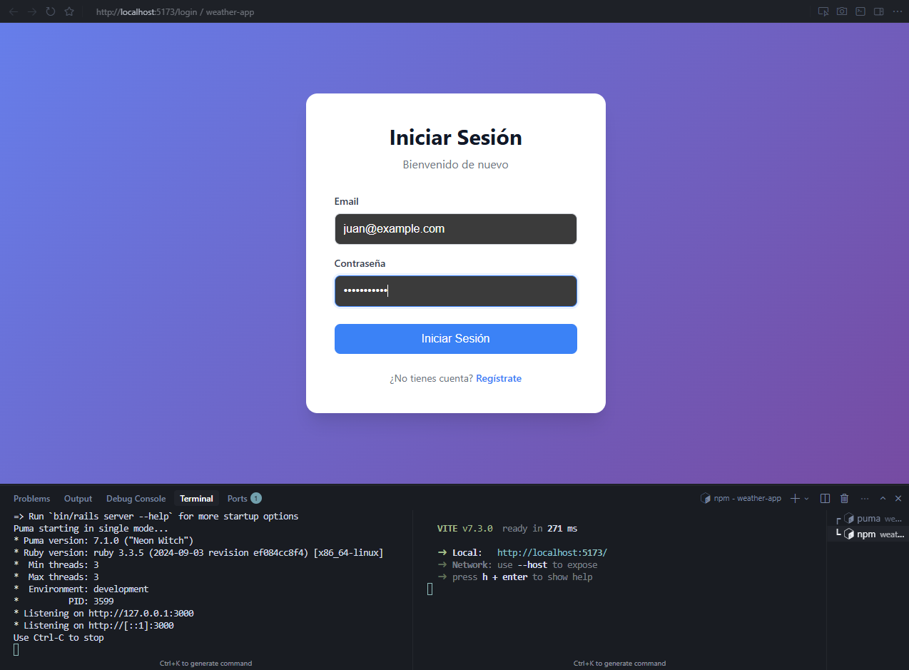
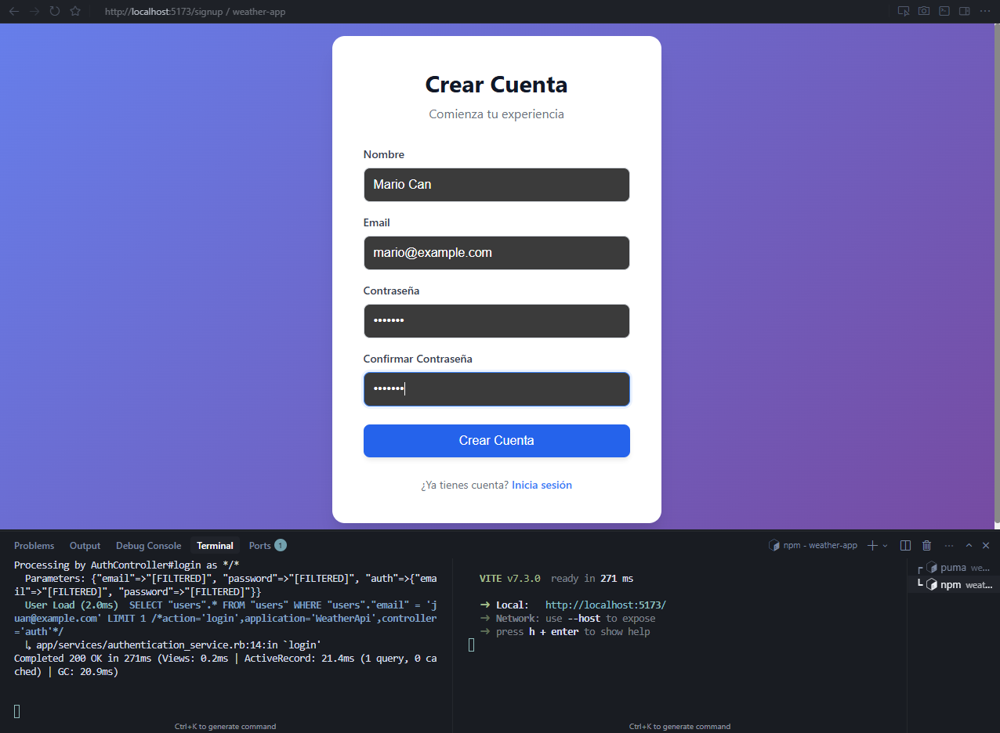
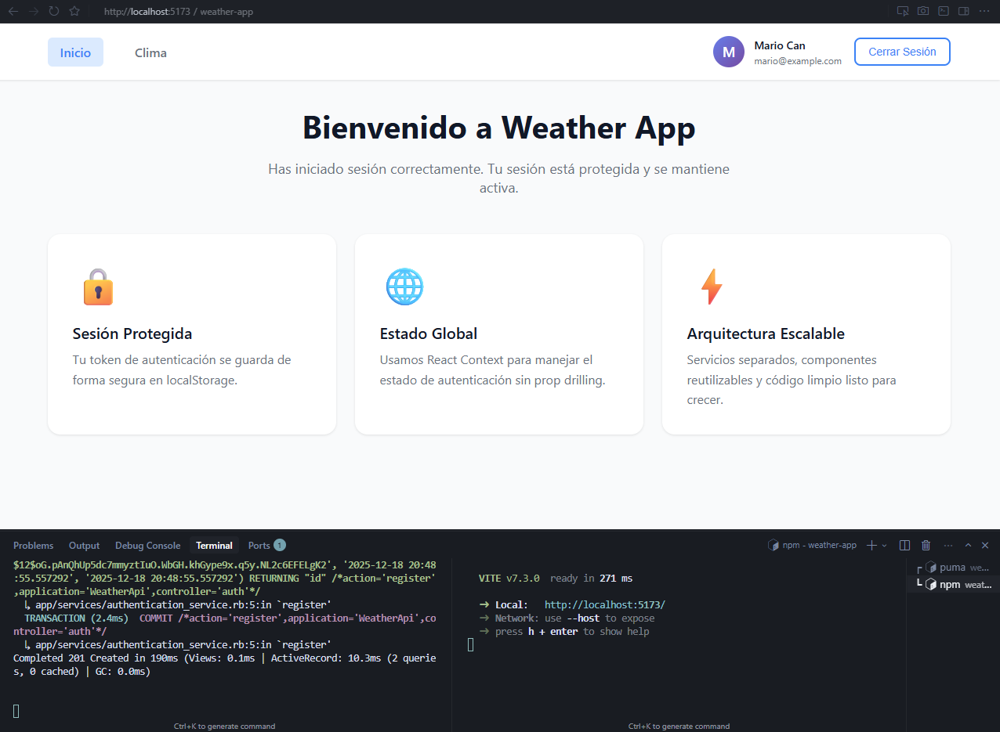
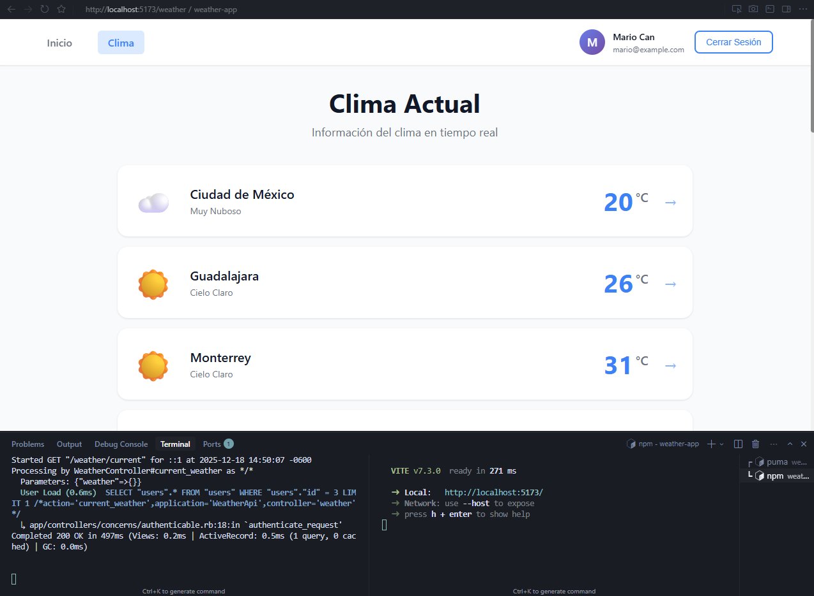
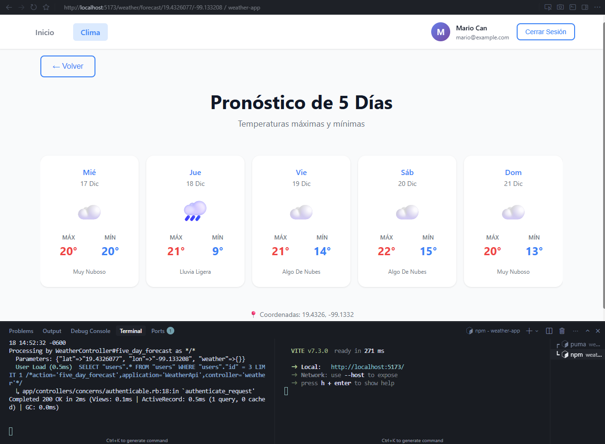

# weather-api
API REST que permite mostrar el clima actual y de los próximos 7 días en distintas ciudades.   

## Alcance

- Sign up y Login de usuarios
- Lista de ciudades
- Clima actual
- Clima de los próximos 7 días
- Llamadas a OpenWeather con caching
- Manejo de estado y navegación fluida
- Diseño mobile-friendly (No es necesario pixel perfect, solo usable)

## Ejecución del proyecto

### Backend

#### Prerrequisitos
- Ruby >= 3.3.5
- Rails >= 8.1.1
- PostgreSQL
- Archivo dotenv con:
  - WEATHER_API_DATABASE_PASSWORD
  - OPENWEATHER_API_KEY

```bash
# Instalar dependencias
bundle install

# Configurar variables de entorno
cp .env.example .env
# Editar .env y agregar OPENWEATHER_API_KEY=tu_api_key

# Configurar base de datos
rails db:create
rails db:migrate

# Iniciar servidor
rails server
```

### Frontend
#### Prerrequisitos
- Node.js >= 16
- Backend API corriendo en `http://localhost:3000`

### Instalación

```bash
# Instalar dependencias
npm install

# Ejecutar en modo desarrollo
npm run dev
```

## Tecnologías

Backend: Ruby on Rails
Database: PostgreSQL
Cache: Rails cache.
Frontend: React con JS
Nota: Tengo conocimientos en todas las tecnologías listadas para escribir los prompts y son las que se usan en Reservamos.

Arquitectura: 
- Backend: MVC con controllers delgados y servicios.
Nota: Al ser un proyecto pequeño debo utilizar una arquitectura sencilla, sin embargo, seleccioné los servicios porque me gusta que mis proyectos sean escalables y limpios.

- Frontend: Servicios, hooks, React Context y componentes visuales simples.
Nota: De esta manera se pueden reutilizar los componentes creados de ser posible, se puede hacer un manejo de estados
más global y se le da responsabilidad única a cada cosa.

## Proceso

### Backend
- Realizar la planeación de lo que quiero primero.
- Escribir el primer prompt con endpoints de prueba.
- Después de crear la primera tarea con el prompt me puse a configurar las credenciales de PostgreSQL.
- Realizar un análisis de las APIs que debía consumir
- Realizar los prompts necesarios para terminar con las siguientes tareas.
- Al terminar los prompts eliminé de todos los controllers la línea: skip_before_action :verify_authenticity_token.
- Agregué la API_Key en el dotenv sin que el LLM conozca su existencia.
- Hacer pruebas de los endpoints en Postman.
- Hacer pruebas de los endpoints con Frontend.
- Agregué el query param "lang" en OpenWeather para obtener los climas en español.

### Frontend
- Realizar planeación de arquitectura.
- Escribir el primer prompt.
- Probar la conexión con el Backend.
- Redactar los siguientes prompts.
- Probar después de terminar cada uno.

Nota: Durante todo el proceso de generación de código por prompts me aseguré de supervisar que la lógica tuviera sentido. Para afinar los prompts intenté copiar la misma estructura según lo que necesité mientras el agente tenía el contexto. 

## Pantallas

### Pantalla de login


- Se deben llenar los campos.
- Se puede ir a la pantalla de registro.
- Validacion de campos faltantes.

### Pantalla de registro


- Se deben llenar los campos.
- Se puede ir a la pantalla de login.

### Pantalla de home


- Se puede cerrar sesion desde el navbar.
- Se puede ir a la pagina del listado de ciudades desde el navbar.

### Pantalla de listado de ciudades


- Se puede cerrar sesion desde el navbar.
- Se puede ir a la pantalla de inicio desde el navbar.
- Se le puede dar click a una ciudad y eso lleva a la pantalla de pronostico del clima.

### Pantalla del pronostico del clima


- Se puede cerrar sesion desde el navbar.
- Se puede ir a inicio desde el navbar.
- Se puede volver al listado de climas.

## Prompts Backend

### Setup de User CRUD y AuthService
Actúa como un ingeniero de software senior especializado en Ruby on Rails. 

Contexto:
API REST en Rails 8 con PostgreSQL.
Se usa ActiveRecord como ORM. 
Arquitectura con controllers delgados.
No se usan vistas.
Se acaba de crear el proyecto con: "rails new weather-api --api -d=postgresql -T"

Objetivo:
Implementar autenticación y manejo de usuarios siguiendo buenas prácticas Rails.
Autenticación.
- Permita login POST /auth/login
- Permita registro POST /auth/register
- Use JWT
- Envíe el token en el header: Authorization: Bearer <token>
- Use has_secure_password

Usuarios.
Implementar CRUD para el objeto User:
- GET /users
- GET /users/:id
- PUT /users/:id
- DELETE /users/:id

Validaciones:
- Se espera que el atributo "name" esté presente
- Se espera el atributo "email" esté presente y sea único
- Se espera que el atributo "password" esté presente solo en register y login

Errores y respuestas:
- Respuestas JSON estándar
- Usar HTTP status codes correctos

Restricciones:
- Controllers deben delegar la lógica a services
- No usar lógica de negocio en controllers
- No incluir tests

Formato:
1. Explicación breve
2. Código por archivo
3. Ejemplo de request/response JSON

Nivel de detalle:
Asume que soy un ingeniero backend mid

### Creación del servicio para OpenWeather
Mantén todo lo anterior exactamente igual.

Ahora extiende la solución para:
Crear un servicio en app/services para consumir la API de OpenWeather
- Usar la URL: api.openweathermap.org/data/2.5/forecast?lat={lat}&lon={lon}&appid={API_KEY}
- El API key debe leerse desde un archivo .env
- Usar Faraday
- El servicio debe exponer un método público que reciba lat y lon
- El servicio debe devolver el JSON parseado
- Manejar errores de red y respuestas no exitosas
- No colocar lógica HTTP en controllers

### Creación de servicio para la API de Reservamos
Ahora extiende la solución para:
- Crear un servicio en app/services para consumir la API con URL: https://search.reservamos.mx/api/v2/places
- El servicio debe exponer un método público que:
    - Consuma la API externa
    - Filtre los resultados
    - Devuelva únicamente los objetos cuyo "result_type" sea "city"
- Crear únicamente el endpoint GET /cities
- Usar Faraday
- El servicio debe devolver el JSON parseado
- Manejar errores de red y respuestas no exitosas
- No colocar lógica HTTP en controllers

Contexto:
- La URL devuelve una lista de objetos

Restricciones:
- El controller debe delegar toda la lógica al servicio

### Creación del endpoint para el clima actual y el clima de hoy a 5 días
Manten todo lo anterior exactamente igual.

Ahora extiende la solución para:
- Crear un endpoint POST /weather que:
    - El método nuevo en open_weather_service.rb reciba la información de lat y long de cada ciudad del método get_cities del servicio reservamos_cities_service.rb
    - Que el endpoint devuelva temperatura actual de cada ciudad, se espera:
        - Nombre de la ciudad (Reservamos: "display")
        - Temperatura actual por cada objeto en la lista (OpenWeather: "temp")
        - Condición climática (Soleado, nublado, etc) (OpenWeather: "weather":["main", "description"])
        - lat (Reservamos: "lat")
        - long (Reservamos: "long")
        Nota: Lo agregado entre paréntesis son las key de los objetos de donde se accede a la información de interés
- Crear un endpoint POST /weather/days que:
    - Reciba lat y long como parámetros
    - Permita conocer la temperatura por día de los próximos 5 días de una ciudad en específico, se espera:
        - Día (OpenWeather: "dt_txt")
        - Temperatura máxima/mínima (OpenWeather: "temp_max","temp_min")
        - Condición climática (OpenWeather: "weather":["main", "description"])
- Agregar las temperaturas en unidades métricas generales usando: "&units=metric" en la URL de la API de OpenWeather

Contexto:
- La URL de OpenWeather devuelve una lista de objetos con la siguiente estructura:
{
  "cod": "200",
  "message": 0,
  "cnt": 40,
  "list": [
    {
      "dt": 1765951200,
      "main": {
        "temp": 290.87,
        "feels_like": 289.95,
        "temp_min": 290.87,
        "temp_max": 290.88,
        "pressure": 1016,
        "sea_level": 1016,
        "grnd_level": 764,
        "humidity": 48,
        "temp_kf": -0.01
      },
      "weather": [
        {
          "id": 500,
          "main": "Rain",
          "description": "light rain",
          "icon": "10n"
        }
      ],
      "clouds": {
        "all": 75
      },
      "wind": {
        "speed": 0.5,
        "deg": 208,
        "gust": 0.88
      },
      "visibility": 10000,
      "pop": 0.32,
      "rain": {
        "3h": 0.14
      },
      "sys": {
        "pod": "n"
      },
      "dt_txt": "2025-12-17 06:00:00"
    },
    {
      "dt": 1765962000,
      "main": {
        "temp": 290.39,
        "feels_like": 289.48,
        "temp_min": 289.43,
        "temp_max": 290.39,
        "pressure": 1016,
        "sea_level": 1016,
        "grnd_level": 763,
        "humidity": 50,
        "temp_kf": 0.96
      },
      "weather": [
        {
          "id": 500,
          "main": "Rain",
          "description": "light rain",
          "icon": "10n"
        }
      ],
      "clouds": {
        "all": 68
      },
      "wind": {
        "speed": 1.03,
        "deg": 240,
        "gust": 1.61
      },
      "visibility": 10000,
      "pop": 0.33,
      "rain": {
        "3h": 0.17
      },
      "sys": {
        "pod": "n"
      },
      "dt_txt": "2025-12-17 09:00:00"
    }
],    
"city": {
    "id": 3530597,
    "name": "Mexico City",
    "coord": {
      "lat": 19.4326,
      "lon": -99.1332
    },
    "country": "MX",
    "population": 15000,
    "timezone": -21600,
    "sunrise": 1765890211,
    "sunset": 1765929674
  }
}

Restricciones:
- El controller debe delegar toda la lógica al servicio
- Se debe utilizar Rails cache para la información obtenida de la API de OpenWeather
- Usar Faraday
- El servicio debe devolver el JSON parseado
- Manejar errores de red y respuestas no exitosas
- No colocar lógica HTTP en controllers

## Prompts Frontend

### Setup de carpetas y autenticación
Actúa como un ingeniero de software senior con experiencia en React.

Contexto:
- App frontend creada en React creada con Vite.
- Variante Javascript.
- El Backend es un API REST que expone endpoints de autenticación con host localhost en el puerto 3000.
- Quiero que construyas los primeros primeros pasos de la aplicación priorizando claridad, escalabilidad y buenas prácticas, no soluciones rápidas.
La carpeta del proyecto se llama weather-app.

Objetivo:
Implementar el Signup y Login de usuarios, con manejo de autenticación y estado global, y mostrar el nombre del usuario autenticado en la barra de navegación.

Pantallas:
- Signup
- Login
- Layout principal con barra de navegación

Autenticación:
- Consumir endpoints REST para signup y login.
- Al autenticar correctamente:
    - Guardar el token de autenticación en localStorage
    - Guardar nombre y email del usuario
- Mantener la sesión activa mientras exista el token

UI:
- Interfaz intuitiva y limpia
- Mobile-friendly con responsive básico
- Estados de:
    - loading
    - error
    - usuario autenticado / no autenticado

Navegación:
- Usar navegación fluida entre Login y Signup
- Redirigir al usuario autenticado a una vista protegida
- Mostrar el nombre del usuario autenticado en el navbar

Estado:
- Usar React Context para:
    - estado de autenticación
    - usuario actual
- Evitar prop drilling

Arquitectura:
- Separar las responsabilidades:
    - Un servicio general de API donde la API a consumir es http://localhost:3000/.
    - Un servicio específico de autenticación
    - Un AuthContext/AuthProvider
- No mezclar Lógica HTTP dentro de los componentes

Estructura:
- Proponer una estructura de carpetas claras y escalable
- Componentes visuales separados de la lógica cuando sea posible
- Código legible
- Nombres claros
- Manejo explícito de errores
- Fácilmente escalable para agregar más cosas en el futuro

Restricciones:
- No usar bibliotecas innecesarias

Formato
Explicación breve de:
- Flujo de autenticación
- Decisiones de arquitectura

### Agregar listado de ciudades con su clima actual
Manten todo lo anterior exactamente igual.

Extiende la solución para:
- Implementar una vista que muestre una lista de ciudades con su clima actual, consumiendo el endpoint autenticado:
        - GET /weather/current
- El backend ya se encarga de cruzar datos de Reservamos + OpenWeather, por lo que el frontend solo consume el resultado.
Esta nueva tarea debe integrarse a esa arquitectura existente, no crear soluciones paralelas.
- Ejemplo de respuesta esperada del backend:
{
  "weather": [
    {
      "city_name": "Guadalajara",
      "temperature": 22.5,
      "weather_condition": "Clear",
      "weather_description": "clear sky",
      "lat": 20.6737,
      "long": -103.344
    }
  ],
  "count": 1
}

Vista:
- Solo accesible si el usuario está autenticado
- Redirigir a login si no hay sesión
- Considerar acceder a ello desde el navbar, pero si tienes otra propuesta mejor priorízala

Listado:
- Mostrar una lista de ciudades
- Por cada ciudad mostrar:
    - Nombre de la ciudad
    - Temperatura actual
    - Condición climática

Estados:
- Loading mientras se carga la información
- Manejo de error si la api falla
- Estado vacío si no hay ciudades

UI:
- Clara e intuitiva
- Mobile-friendly
- No se requiere pixel perfect

Servicios:
- Crear un weatherService que consuma /weather/current
- Usar apiService existente
- No colocar lógica HTTP en componentes

Manejar estados locales para:
- lista de climas
- error
- loading

Componentes:
- Separar:
    - Vista
    - Lógica
- Componentes simples y reutilizables

Navegación:
- Integrar la vista en el router existente
- Mantener navegación fluida

### Agregar vista del pronóstico del clima de los siguientes 5 días en una ciudad del listado
Manten todo lo anterior exactamente igual.

Extiende la solución para:
- Implementar una vista que permita visualizar la temperatura de los próximos 5 días en una ciudad:
        - GET /weather/days
        - Params: lat y lon
- El backend ya se encarga de cruzar datos de Reservamos + OpenWeather, por lo que el frontend solo consume el resultado.
- Debe accederse dando click en una de las ciudades listadas en la vista de ciudades que ya existe.
- Los params se podrán obtener por medio de la información de la ciudad a la que se le hizo click utilizando su "lat" y "long".
- Esta nueva tarea debe integrarse a esa arquitectura existente, no crear soluciones paralelas.
- Ejemplo de respuesta esperada del backend:
@API_DOCUMENTATION.md (536-572) 

Vista:
- Solo accesible si el usuario está autenticado
- Redirigir a login si no hay sesión

Listado:
- Mostrar una lista de las temperaturas de cada día
- Acomodado horizontalmente
- Por día:
    - Fecha
    - Día (Por medio de bibliotecas del frontend)
    - Temperatura mínima
    - Temperatura máxima
    - Condición climática

Estados:
- Loading mientras se carga la información
- Manejo de error si la api falla
- Estado vacío si no hay climas

UI:
- Clara e intuitiva
- Mobile-friendly
- No se requiere pixel perfect

Servicios:
- Usar el weatherService existente para que consuma /weather/days
- Usar apiService existente
- No colocar lógica HTTP en componentes

Manejar estados locales para:
- lista de climas
- error
- loading

Componentes:
- Separar:
    - Vista
    - Lógica
- Componentes simples y reutilizables

Navegación:
- Integrar la vista en el router existente
- Mantener navegación fluida
